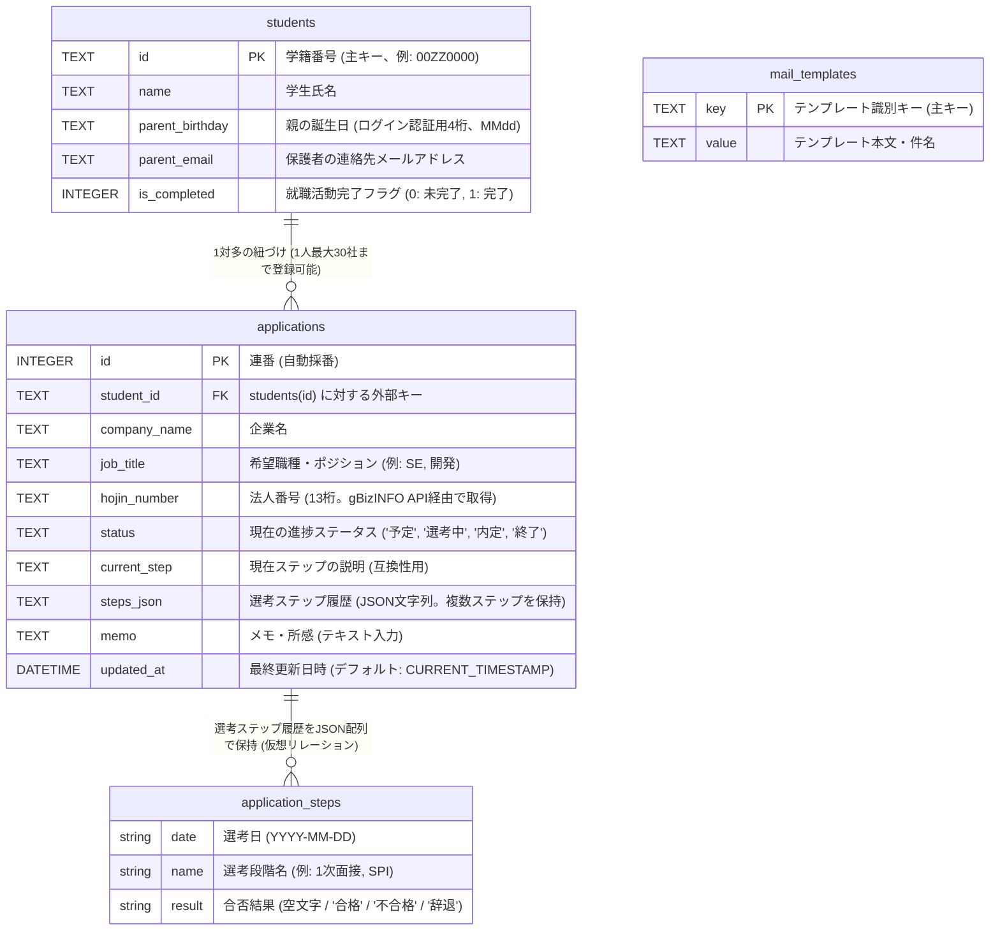
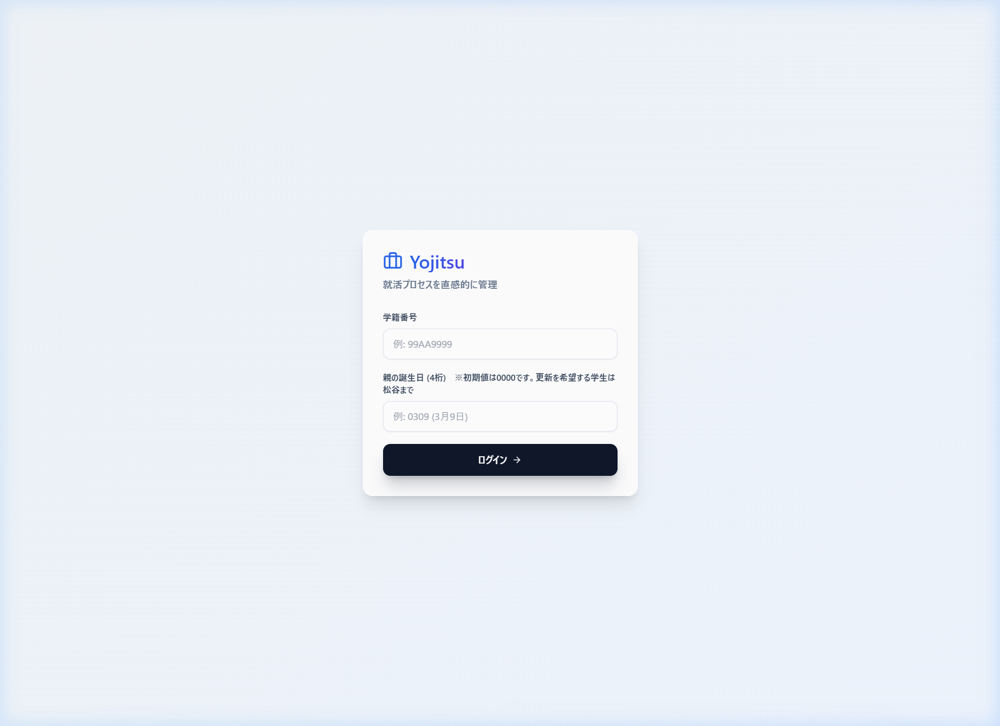
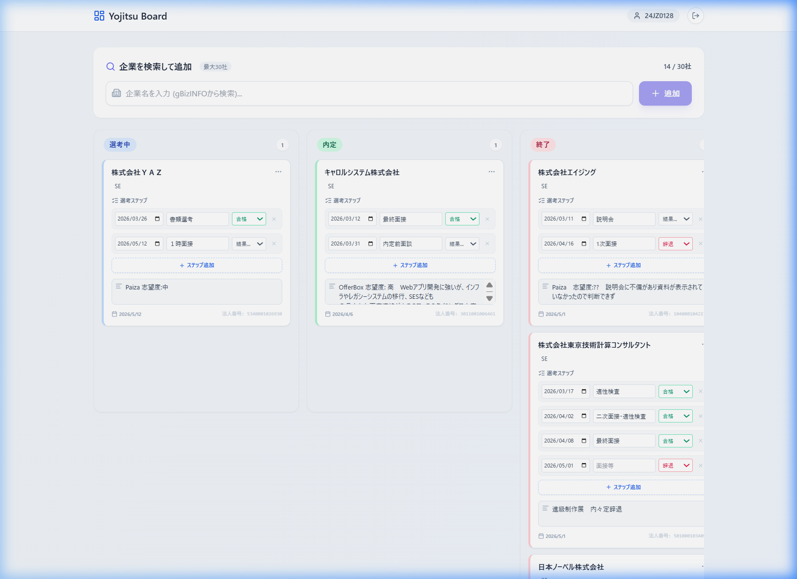
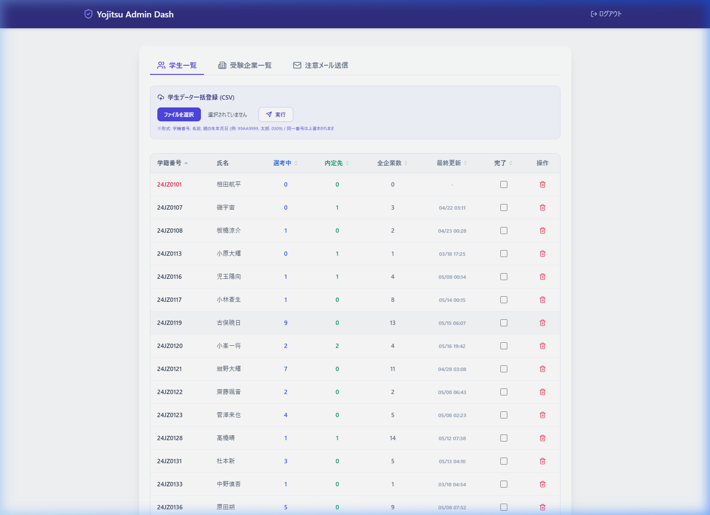
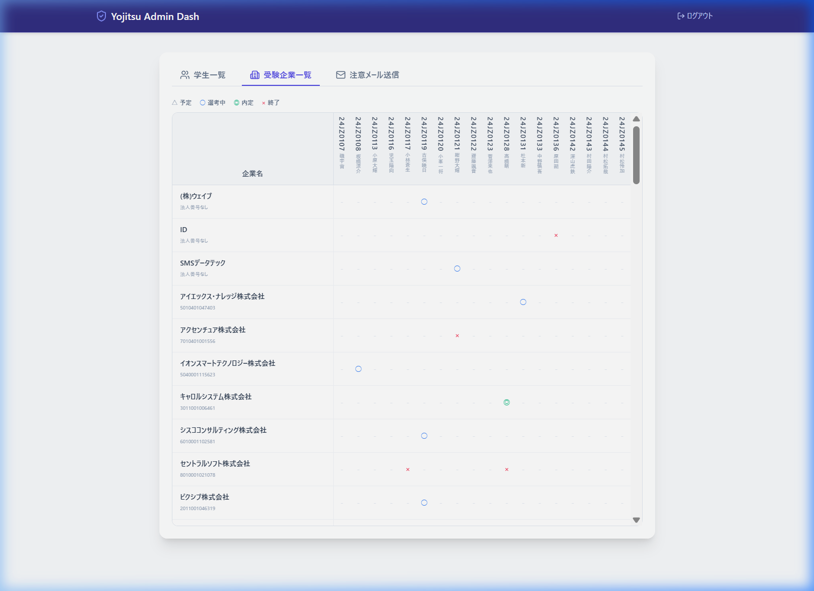
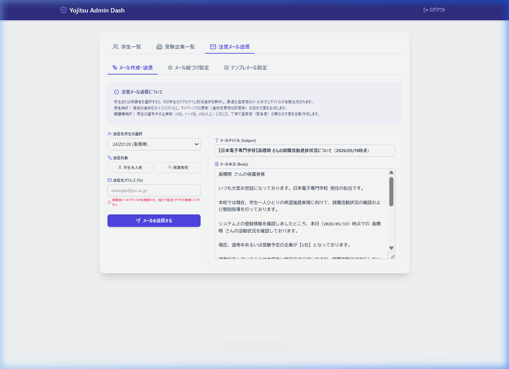
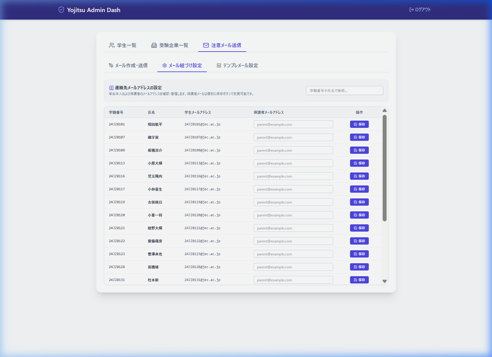
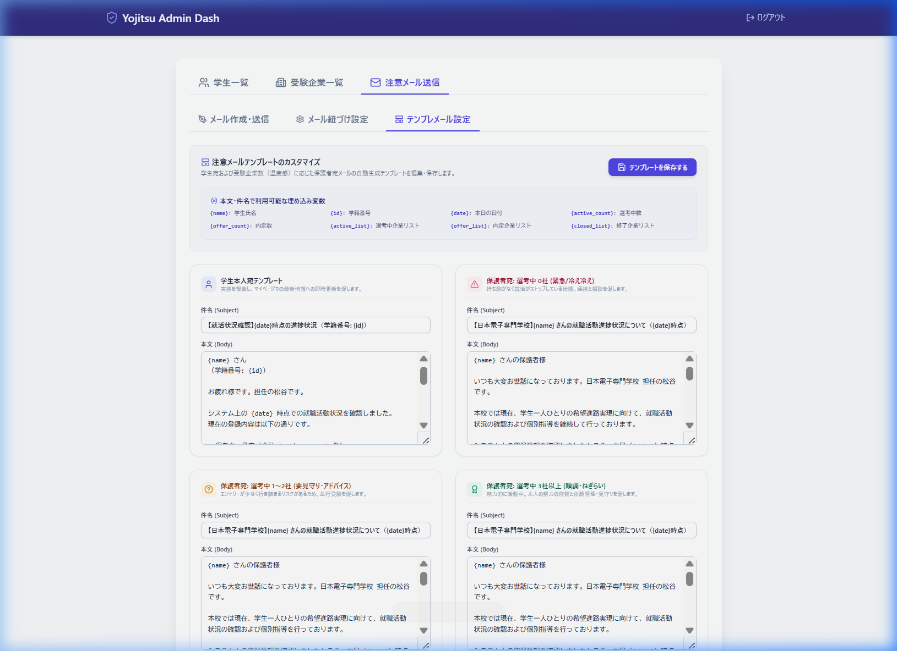

# Yojitsu 就活状況管理システム 設計仕様書

本書は、「Yojitsu（ヨジツ）」就活状況管理システムのシステム構成、データベース設計、API仕様、フロントエンドの画面および機能設計を網羅した詳細仕様書である。次期AIエージェントが本システムをゼロから再構築できる完全な引き継ぎ資料として作成されている。

---

## 1. システム概要 & 技術スタック

本システムは、学生が各自の就職活動状況（選考企業や進捗ステップ）をカンバン形式で管理し、教員（管理者）が全学生の進捗を横断的に監視・支援・個別メール送信できるWebアプリケーションである。

### 技術スタック
- **サーバーサイド**: [Hono](https://hono.dev/) on [Cloudflare Workers](https://workers.cloudflare.com/)
- **フロントエンド**: Hono JSX (サーバーサイドレンダリング) + Vanilla JS / CSS (Tailwind CSS (CDN経由) & Lucide アイコン)
- **ビルドツール**: [esbuild](https://esbuild.github.io/) (クライアントサイドスクリプトのバンドル)
- **データベース**: [Cloudflare D1](https://developers.cloudflare.com/d1/) (SQLite互換分散リレーショナルデータベース)
- **外部API連携**:
  - 企業検索: [gBizINFO API](https://info.gbiz.go.jp/hojin/v1/hojin) (法人番号および正式企業名取得)
  - メール送信: Google Apps Script (GAS) Webhook (教員からの注意メール転送用)

---

## 2. データベース設計 (Database Schema)

データベースには Cloudflare D1 を使用する。3つの主要テーブル（`students`, `applications`, `mail_templates`）で構成されている。

### ER図



### SQLテーブル定義 (`schema.sql`)

```sql
CREATE TABLE IF NOT EXISTS students (
  id TEXT PRIMARY KEY, -- 学籍番号 (例: REDACTED)
  name TEXT NOT NULL,  -- 氏名
  parent_birthday TEXT, -- 親の誕生日 (4桁, 例: 0309)
  parent_email TEXT, -- 保護者メールアドレス
  is_completed INTEGER DEFAULT 0 -- 就活完了フラグ (0:未完了, 1:完了)
);

-- 就活カード
CREATE TABLE IF NOT EXISTS applications (
  id INTEGER PRIMARY KEY AUTOINCREMENT,
  student_id TEXT NOT NULL,
  company_name TEXT NOT NULL,
  job_title TEXT,
  hojin_number TEXT,
  status TEXT DEFAULT '予定', -- 予定, 選考中, 内定, 終了
  current_step TEXT DEFAULT '未着手', -- 互換用デフォルト値
  steps_json TEXT, -- 選考ステップ履歴配列のJSON文字列
  memo TEXT,
  updated_at DATETIME DEFAULT CURRENT_TIMESTAMP,
  FOREIGN KEY (student_id) REFERENCES students(id)
);

-- メールテンプレート
CREATE TABLE IF NOT EXISTS mail_templates (
  key TEXT PRIMARY KEY,
  value TEXT NOT NULL
);
```

### JSONデータ構造 (`steps_json`)
各カード（`applications`）の `steps_json` は、選考ステップの履歴を時系列に保持する。
```json
[
  {
    "date": "2026-03-09",
    "name": "書類選考・適性検査",
    "result": "合格"
  },
  {
    "date": "2026-03-26",
    "name": "一次面接（グループ面接）",
    "result": "不合格"
  }
]
```

---

## 3. API エンドポイント仕様 (API Reference)

すべてのエンドポイントのベースパスは `/api` である。

### 3.1 学生・管理者ログイン
*   **POST `/login`**
    *   **説明**: 学生の学籍番号と誕生日による認証、または教員用パスの検証。
    *   **リクエストボディ (JSON)**:
        ```json
        { "student_id": "REDACTED", "parent_birthday": "0000" }
        ```
    *   **レスポンス**:
        *   **成功 (200)**:
            ```json
            { "success": true, "name": "REDACTED" }
            ```
        *   **失敗 (401 / 400)**:
            ```json
            { "error": "学籍番号または誕生日が正しくありません" }
            ```

### 3.2 企業検索 (gBizINFO連携)
*   **GET `/search`**
    *   **説明**: 登録時に企業名を入力された際、gBizINFOから正式名称と法人番号を取得する。
    *   **クエリパラメータ**:
        *   `name` (string, 必須): 検索ワード
    *   **レスポンス (200)**:
        ```json
        [
          { "name": "キャロルシステム株式会社", "number": "3011001006461" },
          { "name": "株式会社共立ソリューションズ", "number": "4010001066795" }
        ]
        ```

### 3.3 カンバンカード管理
*   **GET `/cards`**
    *   **説明**: 指定した学生のカード一覧を取得する（管理者も同一エンドポイントで読み込み可能）。
    *   **クエリパラメータ**:
        *   `student_id` (string, 任意): 指定時は該当学生のカードのみ取得。指定しない場合は全カードを取得。
    *   **レスポンス (200)**:
        ```json
        {
          "選考中": [
            {
              "id": 5,
              "student_id": "REDACTED",
              "company_name": "キャロルシステム株式会社",
              "job_title": "SE",
              "hojin_number": "3011001006461",
              "status": "選考中",
              "current_step": "未着手",
              "steps_json": "[{\"name\":\"最終面接\",\"date\":\"2026-03-12\",\"result\":\"合格\"}]",
              "memo": "OfferBox経由",
              "updated_at": "2026-04-06 12:24:45"
            }
          ],
          "内定": [],
          "終了": []
        }
        ```
        *(注: クライアント側のカンバンカラムは「選考中」「内定」「終了」の3つ。DB上の「予定」「選考中」は両方とも「選考中」カラムにマッピングされる)*

*   **POST `/cards`**
    *   **説明**: カードを新規登録する。学生あたり最大30社制限チェックあり。
    *   **リクエストボディ (JSON)**:
        ```json
        {
          "student_id": "REDACTED",
          "company_name": "キャロルシステム株式会社",
          "hojin_number": "3011001006461"
        }
        ```
    *   **レスポンス (200)**:
        ```json
        { "success": true, "id": 5 }
        ```

*   **PATCH `/cards/:id`**
    *   **説明**: カード情報（ステータス、職種、選考履歴、メモ等）の更新。
    *   **リクエストボディ (JSON)** (全フィールド任意):
        ```json
        {
          "status": "内定",
          "job_title": "SE",
          "steps_json": "[...]",
          "memo": "承諾決定しました"
        }
        ```
    *   **レスポンス (200)**:
        ```json
        { "success": true }
        ```

### 3.4 管理者専用 API
> 以下のすべてのエンドポイントは、`admin_id` クエリパラメータが必要。
> 環境変数 `ADMIN_ID` (ローカル開発環境では `.dev.vars` 上の定義値) と一致しない場合は `401 Unauthorized` を返す。

*   **GET `/admin/students?admin_id=...`**
    *   **説明**: 全学生の就活統計情報（選考中社数、内定獲得社数、終了社数、最終更新、完了フラグ）を一覧取得する。
    *   **レスポンス (200)**:
        ```json
        {
          "students": [
            {
              "student_id": "REDACTED",
              "student_name": "REDACTED",
              "parent_email": "user@example.invalid",
              "is_completed": 0,
              "active_count": 1,
              "offer_count": 1,
              "closed_count": 10,
              "last_updated": "2026-05-12T07:38:09"
            }
          ]
        }
        ```

*   **GET `/admin/matrix?admin_id=...`**
    *   **説明**: 受験企業ごとの全学生の応募状況マトリクスを返却する。
    *   **レスポンス (200)**:
        ```json
        {
          "matrix": [
            {
              "company_name": "キャロルシステム株式会社",
              "hojin_number": "3011001006461",
              "status": "内定",
              "student_id": "REDACTED",
              "student_name": "REDACTED"
            }
          ]
        }
        ```

*   **POST `/admin/students/bulk?admin_id=...`**
    *   **説明**: CSV文字列を利用した学生の一括インポートおよび親誕生日設定（上書き可）。
    *   **リクエストボディ (JSON)**:
        ```json
        {
          "csv": "00ZZ0000,テスト タロウ,0000\n00ZZ0000,テスト ジロウ,0000"
        }
        ```
    *   **レスポンス (200)**:
        ```json
        { "success": true, "count": 2 }
        ```

*   **PATCH `/admin/students/:id?admin_id=...`**
    *   **説明**: 学生データの更新（完了フラグのオンオフ、保護者連絡先メールアドレスの紐づけ）。
    *   **リクエストボディ (JSON)** (任意):
        ```json
        {
          "is_completed": true,
          "parent_email": "user@example.invalid"
        }
        ```
    *   **レスポンス (200)**:
        ```json
        { "success": true }
        ```

*   **DELETE `/admin/students/:id?admin_id=...`**
    *   **説明**: 学生レコードとそれに関連するすべての applications をDBから完全削除。
    *   **レスポンス (200)**:
        ```json
        { "success": true }
        ```

*   **GET `/admin/templates?admin_id=...`**
    *   **説明**: メール送信用のテンプレート（4パターン分）を取得。
    *   **レスポンス (200)**:
        ```json
        {
          "templates": {
            "tplStudentSubject": "【就活状況確認】{date}時点の進捗状況",
            "tplStudentBody": "{name} さん\n...",
            "tplParent0Subject": "...",
            "tplParent0Body": "...",
            "tplParent1Subject": "...",
            "tplParent1Body": "...",
            "tplParent3Subject": "...",
            "tplParent3Body": "..."
          }
        }
        ```

*   **POST `/admin/templates?admin_id=...`**
    *   **説明**: メールテンプレートを一括してDBに保存。
    *   **リクエストボディ (JSON)**:
        ```json
        {
          "templates": {
            "tplStudentSubject": "...",
            "tplStudentBody": "..."
          }
        }
        ```
    *   **レスポンス (200)**:
        ```json
        { "success": true }
        ```

*   **POST `/admin/send-email?admin_id=...`**
    *   **説明**: 自動生成したメールを外部のGoogle Apps Script Webhook (`GAS_EMAIL_URL`) 経由で実送信する。
    *   **リクエストボディ (JSON)**:
        ```json
        {
          "to": "user@example.invalid",
          "subject": "保護者向けメール件名",
          "body": "メール本文"
        }
        ```
    *   **レスポンス (200)**:
        ```json
        { "success": true }
        ```

---

## 4. フロントエンド画面・機能仕様

フロントエンドは単一のHTML（単一のエントリーファイル `/` に全ビューが読み込まれ、クライアントJavaScriptで表示/非表示を切り替える疑似SPA）として実装されている。

- **ログイン画面 (`#loginView`)**
- **学生用カンバンボード画面 (`#kanbanView`)**
- **管理者ダッシュボード画面 (`#adminView`)**

### 4.1 ログイン画面

- **ユーザーアクション**:
  - `学籍番号` (または管理者用の管理者ID) を入力。
  - `親の誕生日 (4桁)` を入力。
  - ログインボタンを押下するか、入力欄で Enter キーを押すと、`login()` が実行される。
- **認証判定処理**:
  1. まず、入力された学籍番号を管理者IDとみなして `/api/admin/students?admin_id=...` にリクエストを送る。
  2. もし `200` レスポンスが返れば、教員アカウントとして認証し、管理者画面 (`adminView`) を表示する。
  3. `401`エラー（認証失敗）となった場合は、学生ログインの通常判定に移り、誕生日を入力必須にした上で、 `/api/login` (POST) にリクエストする。
  4. 認証成功後、カンバン画面 (`kanbanView`) を描画する。

#### 【画面イメージ】


---

### 4.2 学生用カンバンボード画面 (閲覧用を含む)

- **ユーザーアクション**:
  - **企業検索と追加**:
    - 検索ボックス (`#searchInput`) に入力すると、gBizINFO API をコールし、下にサジェスト候補を表示する。
    - サジェストから選択すると、正式名と法人番号が自動入力され、「追加」ボタンが活性化。追加すると「選考中」カラムに新規カードが挿入される。
    - 検索結果に見つからない場合、手動入力名そのままで新規登録可能。
  - **カラム移動 (ドラッグ＆ドロップ)**:
    - HTML5 Drag and Drop API を使用して、カードを他のカラム（選考中 / 内定 / 終了）へ移動可能。
    - 移動時に裏側で `/api/cards/:id` (PATCH) を呼び出し、`status` を更新する。
  - **カード内詳細情報の更新**:
    - 「希望職種」のテキスト入力 (変更時に自動PATCH保存)。
    - 「選考ステップ」の追加・編集: 日付（必須）を入力、ステップ名 (面接等)、合否結果 (合格 / 不合格 / 辞退) の選択。ステップは「ステップ追加」から複数追加でき、個別削除も可能。
    - 「メモ・所感」のテキストエリア編集 (フォーカスアウト/変更時に自動PATCH保存)。
- **教員閲覧モード（閲覧のみ）**:
  - 教員が学生名をクリックして代行ログイン（閲覧）した場合は、`w.isReadOnly` フラグが `true` となり、**企業の新規追加フォームが非表示になり、すべての入力欄・セレクト・ドラッグ＆ドロップ・追加/削除ボタンが無効化 (disabled)** される。また、画面上部に「学生一覧へ戻る」ボタンが表示される。

#### 【画面イメージ】


---

### 4.3 管理者画面：学生一覧

- **学生データ一括登録 (CSV)**:
  - `.csv` ファイルを選択して「実行」ボタンをクリック。`学籍番号,名前,誕生日` の形式で一度に学生のリストをインポートできる。
- **統計テーブル**:
  - 各学生の学籍番号、氏名、選考中社数、内定先社数、全企業数、最終更新日時、完了チェックボックス、アクション（削除ボタン）を表示。
  - 学籍番号、選考中、内定先、全企業数、最終更新、完了フラグの各ヘッダーはクリックで昇順/降順ソートが可能。
  - 完了チェックボックス (`is_completed`) はクリックするとその場でPATCH通信し、学生の就活完了マークを切り替える。
  - 行をクリックすると、その学生のカンバンボード画面へ閲覧モードで遷移する。

#### 【画面イメージ】


---

### 4.4 管理者画面：受験企業マトリクス

- **機能概要**:
  - 学生が登録している全企業の状況を網羅した表。
  - 横軸に学生（学籍番号＋氏名を縦書きで表示）、縦軸に企業名（法人番号を含む）を配置。
  - 各セルには、学生の該当企業に対する進捗ステータスをシンボルマークで表示:
    - `予定` ➔ `△` (グレー)
    - `選考中` ➔ `○` (ブルー)
    - `内定` ➔ `◎` (グリーン)
    - `終了` ➔ `×` (ローズレッド)
  - セルまたは列ヘッダーの学生名をクリックすると、その列（学生）の背景がハイライトされ、縦軸データを確認しやすくなる。

#### 【画面イメージ】


---

### 4.5 管理者画面：注意メール送信 (メール作成・送信)

- **自動警告メールドラフト生成**:
  - ドロップダウンから対象学生を選択する。
  - 「学生本人宛」または「保護者宛」を選択する。
  - 学生の「選考中社数」や「選考履歴」を自動解析し、最適な件名と本文を自動生成する。
- **自動生成の温度感分岐ロジック (保護者向け)**:
  - **選考中 0社 (緊急・冷え冷え)**: 「受験予定の企業が0社となっており、次の選考予定が入っていない状況」として、学校での求人紹介や個別面談の対応方針、およびご家庭での見守りと相談を促す重めのトーン。
  - **選考中 1〜2社 (要見守り・アドバイス)**: 「持ち駒が少なくなり選考結果次第で活動が止まってしまうリスク」に備え、並行してエントリー数を1〜2社程度増やすようなアドバイスを促すトーン。
  - **選考中 3社以上 (順調・ねぎらい)**: 「積極的に取り組んでいるが、緊張や疲れが出やすい時期」として、努力のねぎらいと体調面のサポート・見守りをお願いする温かいトーン。
- **一括送信モード**:
  - ドロップダウンで「【一括送信】就活未完了の学生全員」を選択すると、現在 `is_completed` フラグが未完了(0)の全学生に対して、それぞれの状況に応じた本人向けメールを連続して自動生成し、個別送信（GAS API呼び出し）をバックグラウンドで順次実行する。

#### 【画面イメージ】


---

### 4.6 管理者画面：メール紐づけ設定 (連絡先メール紐づけ)

- 学生ごとの本人メール（`学籍番号@jec.ac.jp`）の確認と、保護者連絡先メールアドレスの登録・個別編集・保存ボタンを提供する一覧画面。
- 検索ボックスを使用して、学籍番号や氏名でリアルタイムに絞り込み検索ができる。

#### 【画面イメージ】


---

### 4.7 管理者画面：テンプレメール設定 (メールテンプレート編集)

- 送信用テンプレート（「学生本人宛」「保護者宛: 0社」「保護者宛: 1〜2社」「保護者宛: 3社以上」）のテキスト編集・保存エリア。
- 各テンプレートの件名・本文で以下の埋め込み変数を使用できる：
  - `{name}`: 学生氏名
  - `{id}`: 学籍番号
  - `{date}`: 本日の日付 (YYYY/MM/DD)
  - `{active_count}`: 選考中・予定企業数
  - `{offer_count}`: 内定獲得企業数
  - `{active_list}`: 選考中企業の一覧（職種や現在のステップ、メモを箇条書きしたもの）
  - `{offer_list}`: 内定を保持している企業の一覧
  - `{closed_list}`: 選考が終了した企業の一覧

#### 【画面イメージ】


---

## 5. GAS (Google Apps Script) メール送信連携

管理者の「メールを送信する」処理は、直接メール送信用のAPIを叩くのではなく、Cloudflare Workers の中継により、環境変数 `GAS_EMAIL_URL` で指定された Google Apps Script のウェブアプリエンドポイントを呼び出す。

### リクエストペイロード (GAS Webhook 宛)
```json
{
  "token": "GAS_SECRET_TOKENに定義されたトークン文字列",
  "to": "宛先メールアドレス",
  "subject": "件名",
  "body": "本文"
}
```

### GAS側の想定処理実装イメージ
GAS側では `doPost(e)` を公開し、受け取ったトークンの一致を確認した上で、`GmailApp.sendEmail` を使って実行教員のアカウント等から送信する。

---

## 6. 新規構築時・開発時の注意点

1.  **クライアントスクリプトのビルド**:
    フロントエンドのすべての振る舞いは `src/client/` 内のTypeScriptで書かれているため、コードを変更した場合は必ず `npm run build:client` (esbuild) を実行して `public/js/client.js` を再生成する必要がある。
2.  **環境変数の設定**:
    ローカル開発では `.dev.vars` に `ADMIN_ID` (管理者ログイン用ID)、`GAS_EMAIL_URL` および `GAS_SECRET_TOKEN` を設定する必要がある。これらは自動的に `wrangler dev` 起動時に読み込まれる。
3.  **データベース初期化**:
    新環境での起動時は `schema/schema.sql` を適用し、テストデータ登録のために `seed.sql` や `dump.sql` を流し込むこと。
    - ローカル適用例: `npx wrangler d1 execute yojitsu-db --local --file=schema/schema.sql`
