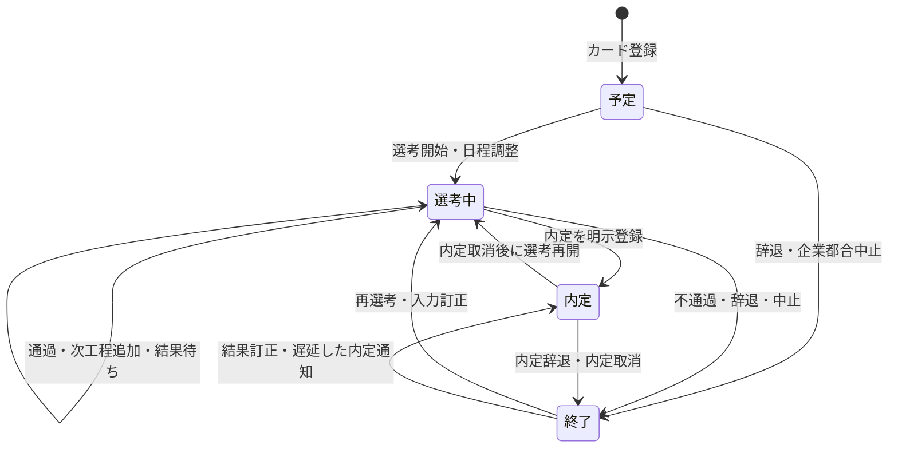

# 選考状態・ステップ状態仕様

最終更新: 2026-07-18

## 1. 目的

応募企業ごとの「カード状態」と、カード内に記録する「選考ステップ状態」を分離して定義します。

選考手順は企業・職種・年度によって異なるため、固定された工程順ではなく、自由なステップ名と少数の共通状態で表現します。例外を無理に標準フローへ当てはめず、利用者による訂正と再開を許可します。

## 2. 用語

### カード状態

応募全体が現在どの局面にあるかを表します。カンバンの列と集計に使用します。

| 状態 | 定義 |
|---|---|
| `予定` | 応募先を登録したが、選考工程がまだ開始していない |
| `選考中` | 少なくとも1つの選考工程が進行中、日程調整中、または結果待ち |
| `内定` | 企業から内定・採用通知を受け、まだ辞退・取消されていない |
| `終了` | 不通過、辞退、企業都合中止、内定辞退・取消などにより、その応募が終了した |

`終了`は物理削除を意味しません。履歴を保持した終端状態であり、再選考や入力訂正によって`選考中`へ戻せます。

### 選考ステップ

説明会、応募、書類選考、適性検査、面接、課題、面談、内定通知など、企業との個別イベントを表します。

ステップ名は自由入力とし、UIでは代表的な候補を提示します。候補にない工程も登録できます。

### ステップ状態

| 状態 | 定義 |
|---|---|
| `日程調整中` | 実施予定だが日時が確定していない |
| `予定` | 実施日時が決まっている |
| `結果待ち` | 実施済みで企業からの結果を待っている |
| `通過` | 次工程へ進む、または当該工程を通過した |
| `不通過` | 当該工程で不採用となった |
| `辞退` | 学生側が当該応募・工程を辞退した |
| `中止` | 企業都合、採用停止、重複登録などで工程を中止した |

「内定」はステップ状態ではなくカード状態です。最終面接の通過と内定通知が一致しない企業があるため、ステップ名や`通過`だけから内定を確定しません。

## 3. カード状態遷移

### 遷移表

| 現在状態 | イベント | 次状態 | 初期判定 | 変更理由 |
|---|---|---|---|---|
| 新規 | カード登録 | `予定` | 自動確定 | 不要 |
| `予定` | 日程調整中・予定・結果待ちのステップ追加 | `選考中` | 自動提案 | 任意 |
| `予定` | 辞退・中止 | `終了` | 自動提案 | 必須 |
| `選考中` | 通過・次工程追加 | `選考中` | 自動提案 | 任意 |
| `選考中` | 不通過・辞退・中止 | `終了` | 自動提案 | 必須 |
| `選考中` | 内定登録 | `内定` | 手動確定 | 必須 |
| `終了` | 再選考・訂正 | `選考中` | 手動確定 | 必須 |
| `終了` | 遅延した内定通知・訂正 | `内定` | 手動確定 | 必須 |
| `内定` | 内定辞退・取消 | `終了` | 手動確定 | 必須 |
| `内定` | 選考再開 | `選考中` | 手動確定 | 必須 |

## 4. 判定の優先順位

カード状態の正本は、利用者が最後に確定した明示状態です。自動処理は状態変更を提案できますが、確定済みの手動状態を無断で上書きしません。

優先順位は次のとおりです。

1. 教員または学生が明示的に確定したカード状態
2. 直近の有効なステップから得られる自動提案
3. 新規カードの既定値`予定`

過去の全ステップを検索して、1件でも`不通過`や`辞退`があれば終了とする判定は禁止します。訂正、再受験、複数経路があるため、直近の有効な経緯と明示状態を優先します。

## 5. 自動提案ルール

- `日程調整中`、`予定`、`結果待ち`、`通過`が追加された場合は`選考中`を提案します。
- 直近の有効ステップが`不通過`、`辞退`、`中止`の場合は`終了`を提案します。
- `内定`は自動提案しません。内定通知を確認した利用者が明示登録します。
- 自動提案を拒否し、現在状態を維持できるようにします。
- 自動提案の採用後も、理由を付けて再変更できます。

## 6. ステップの訂正・取消

- ステップは編集可能とします。
- 誤登録したステップは物理削除せず、取消扱いまたは変更履歴を残す設計を優先します。
- 日程変更は同じステップの予定日更新として扱えます。
- 実施後に結果が未着の場合は`結果待ち`へ変更します。
- 同一名称のステップを複数回登録できます。一次面接の再実施などを妨げません。

## 7. 例外ケース

| ケース | 記録方法 |
|---|---|
| 説明会参加後に応募しない | 説明会を`中止`または`辞退`、カードを`終了` |
| 面接延期 | ステップの予定日を更新。確定前なら`日程調整中` |
| 結果保留 | `結果待ち`を維持し、メモへ期限・確認状況を記録 |
| 不通過後の再選考 | 新しいステップを追加し、カードを`選考中`へ手動再開 |
| 複数職種を並行選考 | 原則として職種ごとにカードを分ける |
| 最終面接通過後に追加面談 | 面談ステップを追加し、カードは`選考中`を維持 |
| 面接なしで内定 | 内定通知等のステップを登録し、カードを手動で`内定` |
| 内定承諾 | カードは`内定`を維持。学生全体の就活完了とは別管理 |
| 内定辞退・取消 | カードを`終了`へ変更し、理由を記録 |
| 企業側の採用中止 | ステップを`中止`、カードを`終了` |

## 8. 状態変更履歴

製品仕様として、手動状態変更時には次を記録します。

- 変更前状態
- 変更後状態
- 変更理由
- 変更者の役割とID
- 変更日時
- 自動提案を採用したか

これはapp DBではなくSP DBだけに保存します。

## 9. app同期との関係

- app由来カードの状態は同期元の値として保持します。
- SPで確定した状態は`application_overrides`側を優先します。
- 再同期でSPの明示状態・状態変更履歴を失いません。
- SPの状態変更をappへ書き戻しません。
- appでカードが削除されてもSPでは即時物理削除せず、参照停止日時を記録します。

## 10. 現在実装との差分

この文書は次回改修の確定仕様です。2026-07-18時点の実装は次の点が未対応です。

- ステップ結果は未入力、`合格`、`不合格`、`辞退`の4値
- 過去に1件でも不合格・辞退があるとカードを`終了`にする
- `最終面接`という完全一致名称と`合格`から`内定`を自動判定する
- 状態変更理由と変更履歴を保存していない
- 自動判定が提案ではなく直接反映される場合がある

実装完了までは、現行画面の挙動を本仕様どおりとみなしてはいけません。

## 11. 受入条件

- 各状態と遷移を単体テストで網羅する。
- `終了`から`選考中`、`終了`から`内定`へ訂正できる。
- 過去の不通過が、再選考後の状態を強制的に終了へ戻さない。
- 最終面接という文字列だけで内定にならない。
- 明示状態は再同期後も維持される。
- 状態変更理由と変更者・日時を確認できる。
- 既存データを失わず新しいステップ状態へ移行できる。
